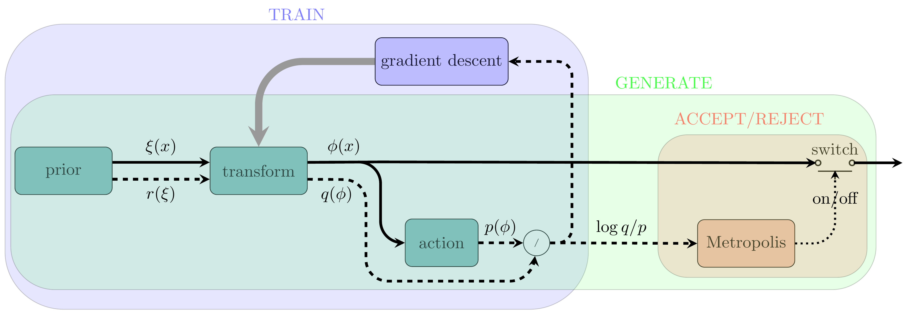

# normflow

This package provides utilities for implementing the **method of normalizing
flows** as a generative model for lattice field theory. The package currently
supports scalar theories and also partially gauge theories.


The method of normalizing flows is a powerful generative modeling approach that
learns complex probability distributions by transforming samples from a simple
distribution through a series of invertible transformations. It has found
applications in various domains, including generative image modeling.


In a nutshell, three essential components are required for the method of
normalizing flows:

*   A **prior distribution** to draw initial samples.
*   A **neural network** to perform a series of invertible transformations on
    the samples.
*   An **action** that specifies the target distribution, defining the goal of
    the generative model.

The central high-level class of the package is called `Model`, which can be
instantiated by providing instances of the three objects mentioned above:
the prior, the neural network, and the action.
To specify the theory, the user can choose from the available actions in
the package, such as a quartic scalar action or the Wilson gauge action.
Next, an appropriate network can be assembled using the package's modules,
which automatically calculate the Jacobian of the transformations. Similarly,
an appropriate prior distribution can be selected. For example, a Gaussian
distribution for scalar theories or uniformly generated SU(N) matrices
(with the Haar measure) for gauge theories.


Each instance of `Model` includes a `train` method, which is responsible for
training the model. The training follows a self-learning strategy, meaning
no external data is required. The goal is to optimize the neural network's
parameters to accurately map the prior distribution to the target distribution.


The training process begins by generating samples from the prior and feeding
them into the neural network. The output is then used to compute the
Kullback-Leibler (KL) divergence, which serves as the default loss function.
The model aims to minimize this loss. KL divergence measures how much one
probability distribution diverges from another, in this case, quantifying the
difference between the transformed data distribution (i.e., the model's
predictions) and the target distribution.
In addition to KL divergence, the `train` method also supports alternative
optimization strategies, such as maximizing the effective sample size (ESS).


In KL divergence minimization, the total derivative of the loss decomposes into
a partial derivative with respect to the parameters and the transformed
variable. The contribution from the partial derivative statistically vanishes,
making it preferable to remove these terms using a reverse flow correction.
(The technique follows Vaitl, L. et al. [arXiv:2207.08219].)
By default, this statistical stability adjustment is enabled in the package.
However, it can be disabled, which speeds up training by roughly a factor of
two or more per epoch, at the cost of reduced training effectiveness.


The calculation of the Kullback-Leibler (KL) divergence requires computing
the determinant of the Jacobian matrix of the transformation. To facilitate
this, the package defines an abstract subclass called `Module_`, which is a
subclass of `torch.nn.Module`. The trailing underscore in the class name
indicates that the `forward` method not only returns the transformed inputs
but also computes and returns the logarithm of the Jacobian determinant as
the second item in a two-item tuple. This functionality is crucial for
applications where the computation of the Jacobian is necessary, such as in
normalizing flows.

Each subclass of `Module_` implements the following methods:

- `forward()`: This method applies the transformation to the input data and
  also computes its log-Jacobian.

- `reverse()`: This method applies the inverse of the transformation and also
  computes its log-Jacobian for the inverse. The reverse transformation is
  often necessary in statistically enhanced minimization of the KL divergence.

By encapsulating the calculation of the determinant of the Jacobian matrix,
the `Module_` subclass provides a structured way to handle transformations
and their inverses efficiently, making it suitable for use in optimization
processes.


For a quick start, please refer to the examples. Below is a simple example of
a scalar theory with one degree of freedom.


```python

from normflow.prior import NormalPrior
from normflow.nn import DistConvertor_

def make_model():
    # Define the prior distribution
    prior = NormalPrior(shape=(1,))

    # Define the action for a scalar \phi^4 theory
    action = ScalarPhi4Action(kappa=0, m_sq=-2.0, lambd=0.2)

    # Initialize the neural network for transformations
    net_ = DistConvertor_(knots_len=10, symmetric=True)

    # Create the Model with the defined components
    model = Model(net_=net_, prior=prior, action=action)

    return model

# Instantiate and train the model
model = make_model()
model.model.trainer.run_training(
    n_epochs=1000,
    batch_size=64,
    hyperparam={'lr': 0.01}
)
```

In this example, we have:

-   **Prior Distribution**: A normal distribution is used with a shape of
    `(1,)`; one could also set `shape=1`.

-   **Action**: A quartic scalar theory is defined with parameters
    `kappa=0`, `m_sq=-2.0`, and `lambda=0.2`.

-   **Neural Network**: The `DistConvertor_` class is used to create the
    transformation network, with `knots_len=10` and symmetry enabled.
    Any instance of this class converts the probability distribution of inputs
    using a rational quadratic spline. In this example, the spline has 10 knots,
    and the distribution is assumed to be symmetric with respect to the origin.

-   **Training**: The model is trained for 1000 epochs with a batch size of 64.


After training the model, one can draw samples using the `posterior` attribute.
To draw `n` samples from the trained distribution, use the following command:

```python
x = model.posterior.sample(n)
```

Note that the trained distribution is almost never identical to the target
distribution, which is specified by the action. To generate samples that are
correctly drawn from the target distribution, similar to Markov Chain Monte
Carlo (MCMC) simulations, one can employ a Metropolis accept/reject step and
discard some of the initial samples. To this end, you can use the following
command:

```python
x = model.mcmc.sample(n)
```

This command draws `n` samples from the trained distribution and applies a
Metropolis accept/reject step to ensure that the samples are correctly drawn.

<p align="center">
    
</p>
<p align="center">
    Block diagram for the method of normalizing flows
</p>


The *TRAIN* and *GENERATE* blocks in the above figure depict the procedures for
training the model and generating samples/configurations. For more information
see [arXiv:2301.01504](https://arxiv.org/abs/2301.01504).


For SU(N) matricces, refer to the example in:
-```
-examples/matrix_model.py
```

In summary, this package provides a robust and flexible framework for
implementing the method of normalizing flows as a generative model for lattice
field theory. With its intuitive design and support for scalar theories, you
can easily adapt it to various dimensions and leverage GPU acceleration for
efficient training. We encourage you to explore the features and capabilities
of the package, and we welcome contributions and feedback to help us improve
and expand its functionality.


| Created by Javad Komijani in 2021 \
| Copyright (C) 2021-26, Javad Komijani
