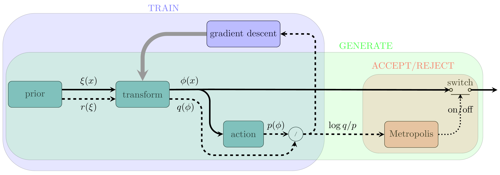
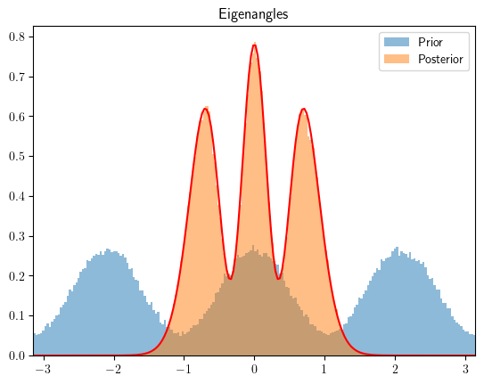
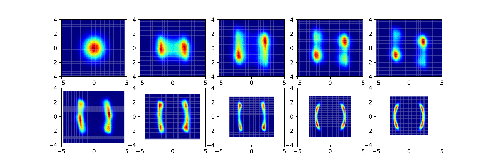

normflow
[](/LICENSE)
--------

This package provides utilities for implementing the **method of normalizing
flows** as a generative model for lattice field theory, transforming samples
from a simple distribution into a target one through a series of invertible
transformations. It currently supports both scalar theories and gauge theories.

Three components define a model: a **prior distribution** to draw initial
samples, a **neural network** of invertible transformations, and an
**action** defining the target distribution. These combine into an instance
of `Model`, the package's central class -- for example, a quartic scalar
action or the Wilson gauge action, paired with a Gaussian prior for scalar
theories or Haar-uniform SU(N) matrices for gauge theories. Networks are
assembled from the package's modules, which automatically compute the
Jacobian of the transformations.

By default, `Model.trainer` follows a self-learning strategy: no external
data is required, and the goal is to optimize the network so that pushing
samples from the prior through it matches the target distribution.


Training draws samples from the prior, pushes them through the network, and
minimizes the Kullback-Leibler (KL) divergence between the transformed prior
and the target distribution -- the default loss function.

In the self-learning scheme, (reverse) KL minimization involves a total
derivative whose partial-derivative term (with respect to the transformed
variable) statistically vanishes; removing it via a reverse flow correction
(Vaitl, L. et al. [arXiv:2207.08219]) improves training stability and is
enabled by default. Disabling it roughly doubles training speed per epoch,
at the cost of reduced effectiveness.

Computing the KL divergence requires the log-determinant of the
transformation's Jacobian. The package's abstract `Module_` class (a
subclass of `torch.nn.Module`) encodes this convention: its `forward()` and
`reverse()` methods each apply the transformation (or its inverse) and
return a `(transformed_input, log_jacobian)` tuple -- the trailing
underscore marks this pattern throughout the package.


For a quick start, please refer to the examples. Below is a simple example of
a scalar theory with one degree of freedom.


```python

from normflow import Model
from normflow.prior import NormalPrior
from normflow.action import ScalarPhi4Action
from normflow.nn import make_real_line_rqs

def make_model():
    # Define the prior distribution
    prior = NormalPrior(shape=(1,))

    # Define the action for a scalar \phi^4 theory
    action = ScalarPhi4Action(kappa=0, m_sq=-2.0, lambd=0.2)

    # Initialize the neural network for transformations
    network_fn_ = make_real_line_rqs(num_spline_knots=10, symmetric=True)

    # Create the Model with the defined components
    model = Model(network_fn_=network_fn_, prior=prior, action=action)

    return model

# Instantiate and train the model
model = make_model()
model.train(
    n_epochs=1000,
    batch_size=64,
    hyperparam={'lr': 0.003}
)
```

Running this example trains in a few seconds and brings the effective sample
size (ESS) close to 1, e.g.:

```python
>>> ess = model.compute_metrics(batch_size=1024)[0]
>>> print(f"ESS (after training): {ess:.4f}")
ESS (after training): 0.9975
```

In this example, we have:

-   **Prior Distribution**: A normal distribution is used with `shape=(1,)`,
    i.e. one degree of freedom.

-   **Action**: A quartic scalar theory is defined with parameters `kappa=0`,
    `m_sq=-2.0`, and `lambda=0.2`.

-   **Neural Network**: `make_real_line_rqs` composes `Expit_`, a rational
    quadratic (RQ) spline, and `Logit_` in sequence: `Expit_` maps the
    unbounded reals to (0, 1), a 10-knot RQ spline reparameterizes it, and
    `Logit_` maps back -- this composition is what lets the spline cover
    the whole real line.
    `symmetric=True` assumes the distribution is symmetric about the origin.

-   **Training**: The model is trained for 1000 epochs with a batch size of 64.


After training the model, one can draw samples using the `posterior` attribute.
To draw `n` samples from the trained distribution, use the following command:

```python
x = model.posterior.sample(n)
```

Note that the trained distribution is almost never identical to the target
distribution, which is specified by the action. To generate samples that are
correctly drawn from the target distribution, similar to Markov Chain Monte
Carlo (MCMC) simulations, one can employ a Metropolis accept/reject step and
discard some of the initial samples. To this end, you can use the following
command:

```python
x = model.mcmc.sample(n)
```

This command draws `n` samples from the trained distribution and applies a
Metropolis accept/reject step to ensure that the samples are correctly drawn.

<p align="center">
    
</p>
<p align="center">
    Block diagram for the method of normalizing flows
</p>


The *TRAIN* and *GENERATE* blocks in the above figure depict the procedures for
training the model and generating samples/configurations. For more information
see [arXiv:2301.01504](https://arxiv.org/abs/2301.01504).


For a more elaborate scalar example, refer to
[examples/scalar_model/scalar_psd_affine_coupling.py](examples/scalar_model/scalar_psd_affine_coupling.py),
which implements a model similar to the one defined in
[arXiv:2301.01504](https://arxiv.org/abs/2301.01504) with PSD flow and
coupling layers.


For SU(N) matrices, two further examples are provided:

- [examples/matrix_model.py](examples/matrix_model.py): a minimal normalizing flow over a single
  SU(N) matrix (SU(2) or SU(3)) -- not a lattice gauge theory, just a
  simple SU(N) matrix -- useful as a quick illustration of the matrix machinery
  (`MatrixModule_` with a `Pade22_`- or `RQSplineNet_`-based parametrization).
  The figure below shows the eigenangle distribution of SU(3) matrices before
  (prior) and after (posterior) training, against the analytic target (red):

  <p align="center">
      
  </p>

- [examples/gauge_elementwise_pade22_slinkflow.py](examples/gauge_elementwise_pade22_slinkflow.py):
  a true lattice gauge theory example. It builds a full lattice of gauge links
  (default shape `4x4x4x4`),
  draws from the uniform (Haar) prior, and trains against the Wilson gauge
  action for U(1), SU(2), or SU(3).
  It also supports distributed training via `torchrun`.
  For more information on this SU(N) gauge-theory approach, see
  J. Komijani, M. K. Marinkovic, *Normalizing flows for SU(N) gauge
  theories employing singular value decomposition*,
  [arXiv:2501.18288](https://arxiv.org/abs/2501.18288) (2025).


For a compact, purely two-dimensional demonstration of the method (no lattice
theory involved), see
[examples/multi-planar-flow.ipynb](examples/multi-planar-flow.ipynb).
It introduces `MultiPlanarFlow_`, a generalization of the planar flows of
Rezende & Mohamed ([arXiv:1505.05770](https://arxiv.org/abs/1505.05770))
along the lines of [arXiv:1803.05649](https://arxiv.org/abs/1803.05649),
and trains it against a multimodal 2D target -- a ring blended with two
Gaussian bumps -- visualizing how the flow reshapes samples from a
Gaussian prior into that target, alongside the training loss curve and
the resulting effective sample size. The figure below shows the sample
distribution after each of the flow's 8 `MultiPlanarFlow_` layers, as the
Gaussian prior (top left) is gradually reshaped into the target:


<p align="center">
    
</p>


Contributions and feedback are welcome.


| Created by Javad Komijani in 2021 \
| Copyright (C) 2021-2026, Javad Komijani
